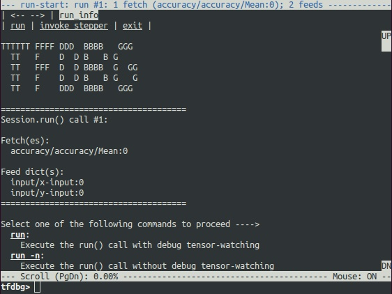
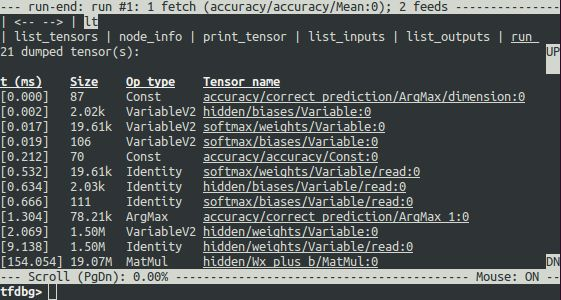
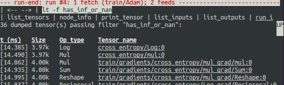
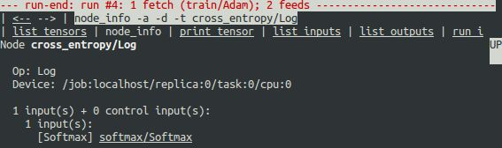
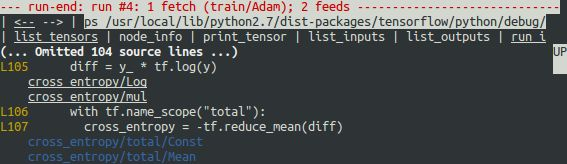
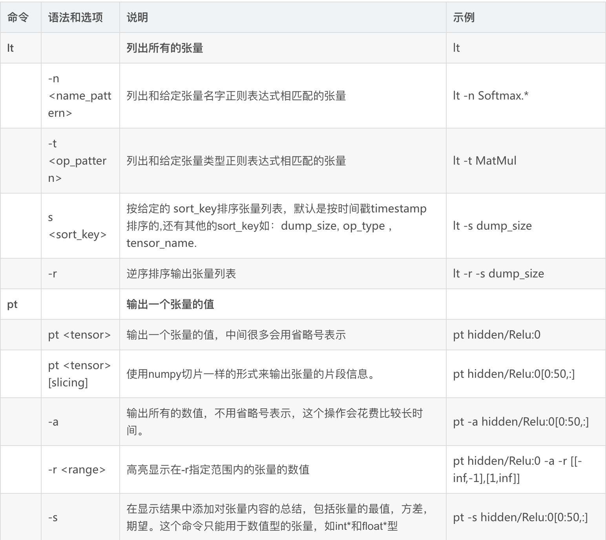
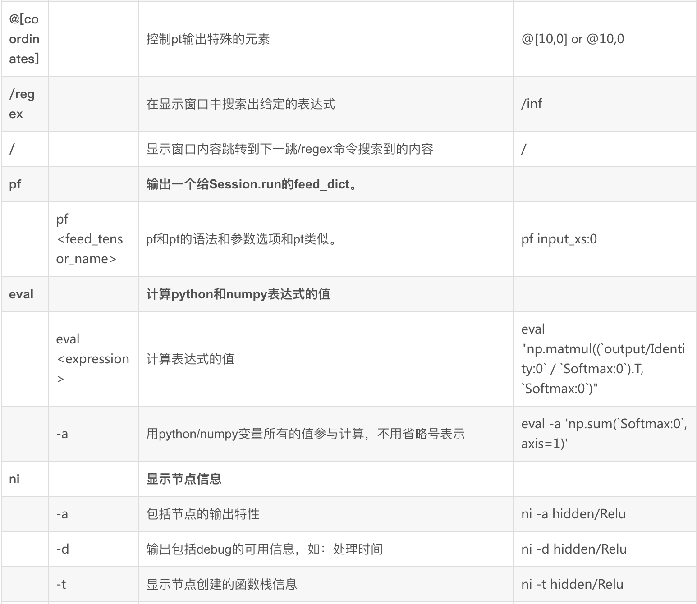
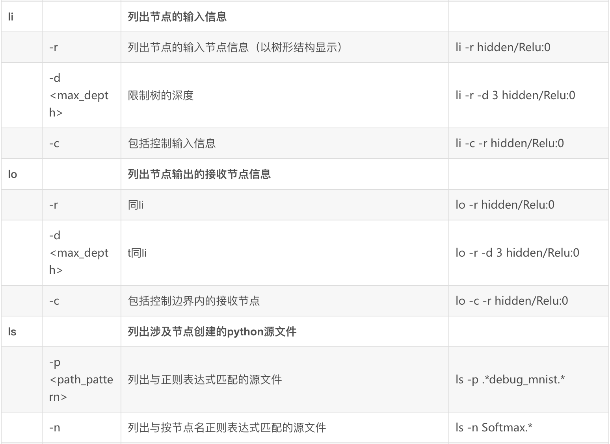
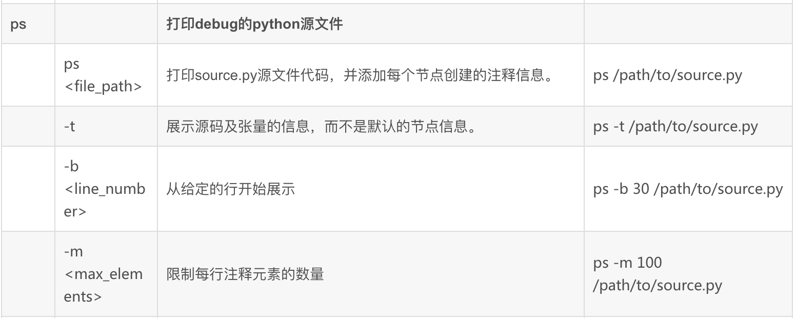
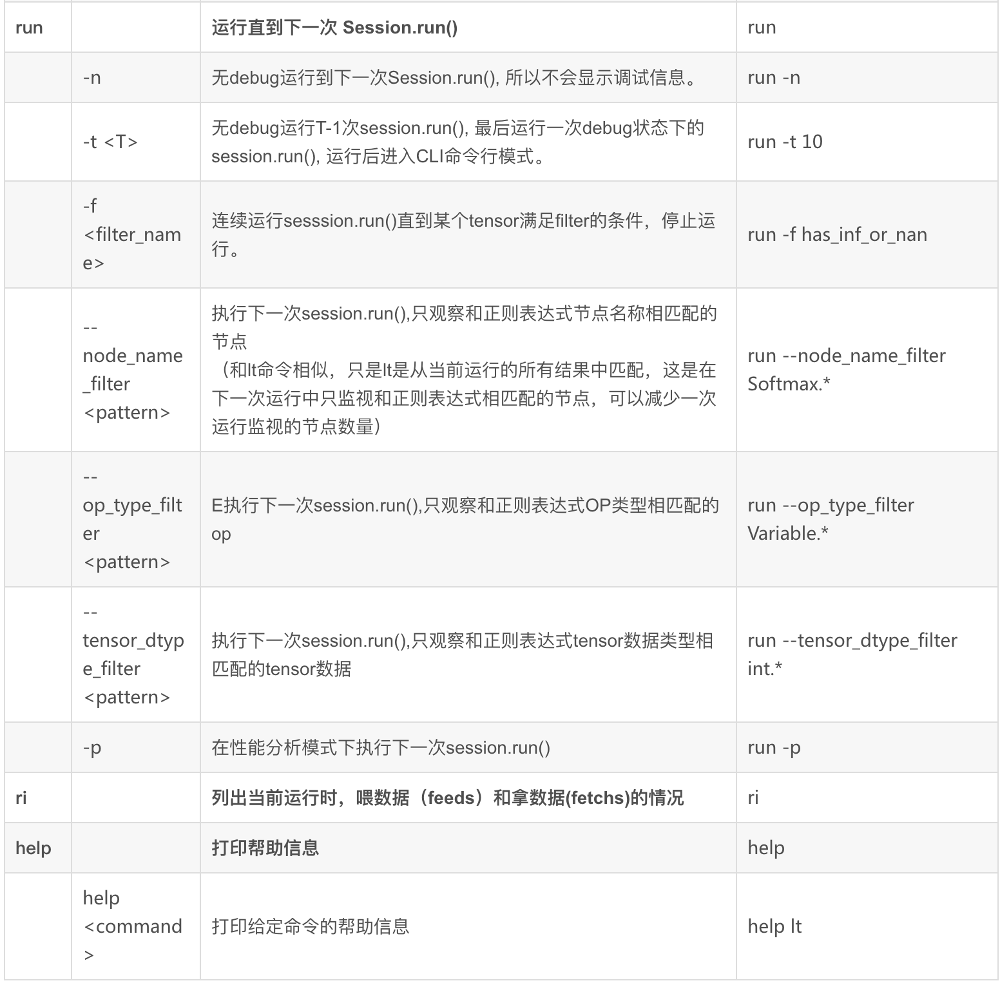

\pagebreak

## 一、添加debug代码

&emsp;&emsp;第一步是用一个调试器包装来包装原有的 Session 对象：

```python
from tensorflow.python import debug as tf_debug

sess = tf_debug.LocalCLIDebugWrapperSession(sess)
```

&emsp;&emsp;这个包装后的 session 与原有的 Session 具有相同的接口，因此启用调试时不需要对代码进行其他更改。

另外这个包装提供了额外的功能，包括：

- 在Session.run（）调用之前和之后调用CLI，让我们可以检查 Graph 的内部状态。
- 允许我们为某个张量 tensor 注册特殊过滤器 filters ，以便于诊断问题。

&emsp;&emsp;最常用的就是 tfdbg.has_inf_or_nan 的张量过滤器 filters ，它可以确定张量中是否有nan或inf值，如果注册了这种过滤器，程序会在运行第一次出现了 nan 或者 inf 的时候停下来，然后你就可以查看计算图 Graph 的各个细节，以确定是哪里出了问题；另外也可以编写自己的自定义过滤器，比如我们要过滤是否出现了某个特定的值。

&emsp;&emsp;我们先看看不提供过滤器，仅仅只是查看模型运行时候的情况，也就是只把上面二个语句加入原有代码里面，然后在命令行里面运行该 Python 代码，就会进入 tfdbg 的命令行界面：



&emsp;&emsp;会出现模型的输入 feed dict 和输出，也就是在 session 中要获取 fetch 的信息；

&emsp;&emsp;如果显示不完整，使用 PageUp / PageDown / Home / End 来翻页，也可以使用 Fn + Up / Fn + Down / Fn + Right / Fn + Left 。

## 二、调试代码

&emsp;&emsp;然后我们就可以在上面图片最后一行位置的 tfdbg> 的后面输入一些命令来控制这个工具了，比如最常用的：

```console
tfdbg> run
```

&emsp;&emsp;这个命令会执行计算图直到下一个 sess.run()，然后会显示所有的中间变量的信息：



&emsp;&emsp;请注意，每次输入命令时，都会显示一个新的屏幕输出。 这有点类似于浏览器中的网页。 通过单击 CLI 左上角的 < - 和 - >文本箭头，可以在这些屏幕之间导航。不过如果界面模式ui_type是鼠标点击 curses 才可以，如果是 readline 就不行。

此外，tfdbg CLI还提供了以下附加功能：

- 要浏览以前的tfdbg命令，输入几个字符，然后按向上或向下箭头键。 tfdbg将显示以这些字符开始的命令的历史记录。
- 使用prev和next命令，或者点击屏幕左上角附近的带有下划线的< - 和 - >链接，浏览屏幕输出的历史记录
- Tab完成命令和一些命令参数。
- 可以使用管道语法将屏幕输出重定向到文件而不是屏幕

```console
tfdbg> pt cross_entropy/Log:0[:, 0:10] > /tmp/xent_value_slices.txt
```

## 三、演示事例

&emsp;&emsp;下面内容演示如何使用 tfdbg 命令行界面（CLI）调试nans和infs的错误，这是TensorFlow 训练中经常遇到的二种错误情况。

### 3.1 条件断点

&emsp;&emsp;以下语句会运行 TensorFlow，直到第一个nan或inf值出现。这类似于某些过程式语言调试器中的条件断点：

```console
tfdbg> run -f has_inf_or_nan
```

&emsp;&emsp;这个命令可以正常工作是因为在之前包装session时已经注册名为 has_inf_or_nan 的张量过滤器。这个过滤器检测nans和infs 。

### 3.2 自定义过滤器

&emsp;&emsp;如果需要运行自定义的过滤器，使用如下语法：

```console
def my_filter_callable(datum, tensor):
    # 定义过滤 0 值
    return len(tensor.shape) == 0 and tensor == 0.0

# 在 session 中添加过滤器
sess.add_tensor_filter('my_filter', my_filter_callable)

# 运行过滤器
tfdbg> run -f my_filter
```



&emsp;&emsp;以这个结果图片为例，当屏幕最顶端显示 #4 ，表示 has_inf_or_nan 过滤器在第四个Session.run（）调用期间被触发，触发过程出现在 Adam 优化器中，总共36个 tensor 包含nan或inf值，这些张量按时间顺序排列，左边显示时间戳，其中错误的数值首先出现在：cross_entropy / Log：0。

### 3.3 正则查询

&emsp;&emsp;要查看张量的值，输入命令：

```console
tfdbg> pt cross_entropy / Log：0
```

&emsp;&emsp;向下滚动一下，你会发现一些分散的inf值。如果inf和nan的实例难以直接找到，可以使用以下命令执行正则表达式搜索并突出显示：

```console
tfdbg> / inf
```

&emsp;&emsp;或者

```console
tfdbg> /（inf | nan）
```

### 3.4 张量数据总结

&emsp;&emsp;还可以使用-s或--numeric_summary命令快速总结张量中的数值：

```console
tfdbg> pt -s cross_entropy/Log:0
```

&emsp;&emsp;从总结中，可以看到`cross_petropy/Log:0`张量的1000个元素中的几个是-infs

### 3.5 查看节点信息

&emsp;&emsp;为什么出现这些无穷大？要进一步调试检查，通过单击顶部带下划线的node_info菜单项或输入相应的node_info（ni）命令来显示有关节点`cross_entropy/Log`的更多信息：

```console
tfdbg> ni cross_entropy/Log
```



&emsp;&emsp;你可以看到这个节点的操作类型为Log，输入是节点`softmax/Softmax`。运行以下命令仔细查看输入张量：

```console
tfdbg> pt softmax/Softmax:0
```

&emsp;&emsp;检查输入张量中的值，搜索零：

```console
tfdbg> / 0.000
```

&emsp;&emsp;确实有零。现在很明显的是，0数值的起源是节点cross_entropy / Log，通过查找零的日志，要找出Python源代码中的罪魁祸首，使用ni命令的-t标志来显示节点构造的起源信息：

```console
tfdbg> ni -t cross_entropy / Log
```

&emsp;&emsp;从回溯查找中，可以看到操作 op 在以下行构建：debug_mnist.py：

```python
diff = y_ * tf.log（y）
```

### 3.6 跟踪回溯到Python源文件

&emsp;&emsp;tfdbg 可以很容易地将张量tensor和操作OP 的创建过程跟踪回溯到Python源文件中的代码行，只要使用ps（或print_source）命令，例如：ps /path/to/source.py：



&emsp;&emsp;要解决这个问题，只需要改变原来自己定义的计算交叉熵的公式：

```python
diff = -（y_ * tf.log（y））
```

&emsp;&emsp;把它改成TensorFlow 定义的比较稳定的 softmax 交叉熵函数：

```console
tfdbg> run -f has_inf_or_nan
```

&emsp;&emsp;确认没有张量被标记为包含nan值或inf值，并且模型指标表现正常，表示已经解决了这个问题。

## 四、常用命令

tfdbg CLI 常用的命令:







## 五、参考链接

1. [TensorFlow 的 debug 工具 tfdbg 使用](https://zhuanlan.zhihu.com/p/33264569)
2. [Tensorflow学习笔记：Debugging 调试Tensorflow 程序](https://blog.csdn.net/u010312436/article/details/78656723)
